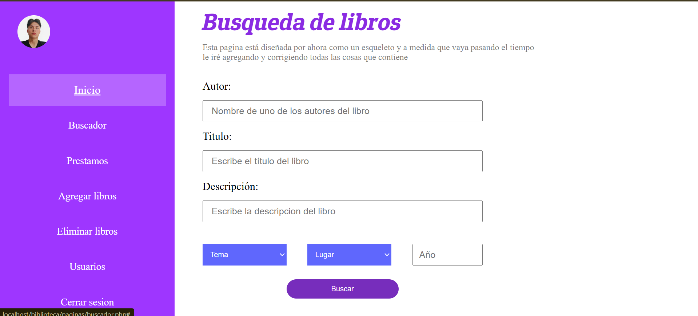
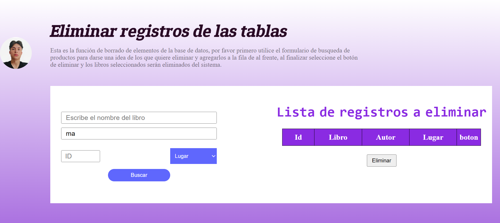
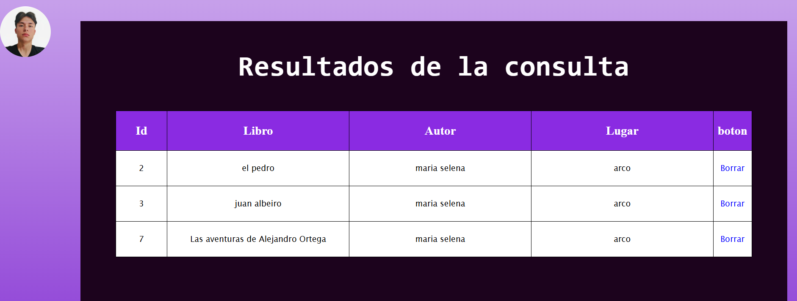
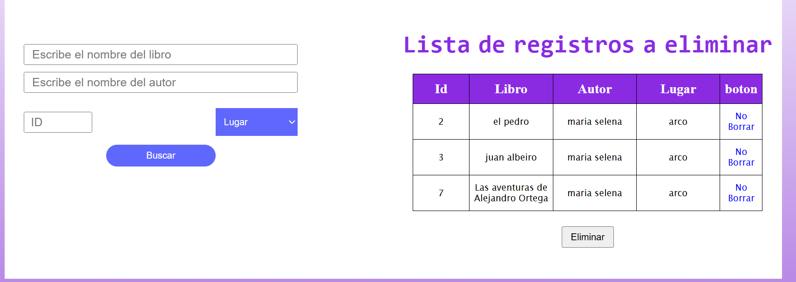

# Proyecto en proceso: Biblioteca

## Descripción
Base de datos con interfaz, usuarios y niveles de acceso a funciones para administrar el registro de inventario de la Biblioteca de la Academia departamental de Norte de Santander, Colombia

## Estado
En desarrollo (última actualización: 07/09/25)

## Funcionalidades
- Agregar nuevos usuarios desde sesión de administrador
- Niveles de acceso
- Login
- Borrar libros
- Registrar y consultar préstamos de libros
- Agregar nuevos libros
- Recuperación de contraseña

## Tecncologías usadas
- HTML5
- CSS3
- PHP
- MYSQL
- JAVASCRIPT

## Capturas

## Login de usuario

## Login

## Busqueda de libros

## Eliminar los registros

## Resultados de la consulta

## Lista de registros a eliminar

